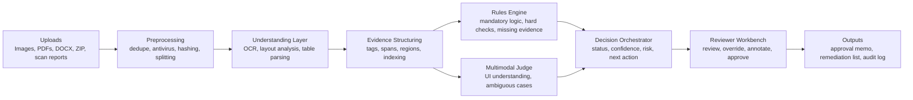

# AI Auto Audit Web System

## Executive Summary

This project is feasible and valuable, but it should be launched as an
"AI first-pass review + human final approval" platform rather than a
fully autonomous approval engine.

Your input data is unusually well suited for this pattern:

- The review checklist is explicit.
- Required items are visually marked.
- Most evidence arrives as screenshots, reports, or documents.
- The output is structured as item-by-item compliance decisions.

The strongest implementation path is a hybrid pipeline:

1. OCR and document parsing extract text and structure.
2. A rules engine performs deterministic checks.
3. A multimodal model handles screenshot understanding and ambiguous cases.
4. A reviewer workbench lets humans confirm, override, and approve.

## What Was Extracted From The Attached Checklist

The attached DOCX table has already been converted into structured data.

- Total checklist items: 22
- Mandatory items highlighted in yellow: 13
- Optional items: 9
- Top-level categories: 5

Category breakdown:

- Authentication hardening: 6
- Internet exposure control: 6
- Access control enhancement: 3
- Traffic monitoring: 3
- Real-time monitoring and alerting: 4

Mandatory item codes:

- 2.8.1.1
- 2.8.1.2
- 2.8.1.5
- 2.8.2.1
- 2.8.2.2
- 2.8.2.3
- 2.8.2.6
- 2.8.3.1
- 2.8.3.2
- 2.8.4.3
- 2.8.5.1
- 2.8.5.2
- 2.8.5.3

This is a strong basis for a rules-driven review workflow.

## Product Positioning

Recommended name:

Security Review AI Assistant Platform

Recommended positioning:

- Not "automatic approval"
- Yes "AI-assisted evidence review and compliance pre-check"

Core product goals:

1. Collect and normalize submitted evidence.
2. Map evidence to checklist items.
3. Produce pass or fail or insufficient-evidence judgments.
4. Explain each judgment with traceable evidence.
5. Let reviewers finalize decisions with full audit history.

## Feasibility Assessment

### High Feasibility

These capabilities are realistic in the first production cycle:

- OCR for screenshots, PDFs, and DOCX files
- Structured extraction from scan reports
- Checklist-by-checklist evidence matching
- Mandatory vs optional branching logic
- Missing evidence detection
- Reviewer workbench with override actions

### Medium Feasibility

These are feasible but need iterative tuning:

- Cross-image reasoning when one conclusion depends on several screenshots
- Scan report normalization across multiple vendor templates
- Confidence scoring that matches reviewer expectations
- Smart evidence recommendations for missing materials

### Low Feasibility For Phase 1

These should not be promised up front:

- Fully autonomous approval with no human review
- Reliable judgment on every ambiguous screenshot
- Universal parsing across all scan-report formats without templates

## Key Risks

1. OCR quality varies with screenshot quality, cropping, and resolution.
2. Some checklist items require combining evidence from multiple files.
3. Users may upload incomplete or mislabeled materials.
4. Scan reports may differ significantly by vendor and version.
5. Reviewers will not trust conclusions unless the evidence path is obvious.

## Recommended System Architecture



## Core Modules

### 1. Intake And Case Management

Supported inputs:

- PNG, JPG, WEBP screenshots
- PDF reports
- DOCX documents
- ZIP packages
- Structured scan reports

Recommended features:

- Automatic ZIP extraction
- File hashing and duplicate detection
- Antivirus scanning
- Case creation and file grouping
- Upload progress and parsing status

### 2. OCR And Parsing Layer

Recommended strategy:

- Primary OCR: PaddleOCR
- Fallback for hard cases: multimodal vision model

Why:

- PaddleOCR official docs cover OCR, layout analysis, table recognition,
  and document-oriented parsing workflows, which fit Chinese screenshots,
  reports, and semi-structured materials well.
- Vision models are best used as a second layer for dense settings pages,
  non-standard screenshots, and cross-evidence reasoning.

Recommended sub-capabilities:

- Page splitting
- Orientation correction
- Text extraction
- Table extraction
- Key-region detection
- Screenshot enhancement
- Report section detection

### 3. Evidence Normalization

All parsed content should become a unified evidence object:

```json
{
  "evidence_id": "ev_xxx",
  "file_name": "fw-rule-01.png",
  "page": 1,
  "region": [120, 88, 920, 540],
  "ocr_text": "Only trusted IPs can access the admin page",
  "tags": ["firewall", "allowlist", "admin access"],
  "possible_requirements": ["2.8.2.3", "2.8.3.1"],
  "confidence": 0.88
}
```

This is the foundation for explainability, search, and reviewer trust.

### 4. Rules Engine

Each checklist item should be configurable, not hardcoded.

Each rule should contain:

- Item code
- Category
- Mandatory flag
- Human-readable requirement
- Expected evidence types
- Positive signals
- Negative signals
- Minimum evidence count
- Decision mode
- Whether manual review is always required

Example:

```json
{
  "code": "2.8.2.3",
  "mandatory": true,
  "name": "Allow only trusted IPs to access the admin interface",
  "expected_evidence_types": ["firewall rule screenshot", "access control config"],
  "positive_signals": ["IP allowlist", "trusted source", "source IP restriction"],
  "negative_signals": ["0.0.0.0/0", "any", "public access"],
  "decision_mode": "rule_plus_llm"
}
```

### 5. Multimodal Judging

Use a vision-capable model only when needed:

- OCR confidence is low
- The screenshot is structurally complex
- Several screenshots must be combined
- The rule requires semantic interpretation

Recommended deployment options:

- Managed API route for faster delivery
- Self-hosted Qwen-VL route for private deployment and sensitive data

Based on the official materials reviewed during this task:

- OpenAI's image and vision guide documents Responses API image input,
  support for up to 500 images and 50 MB per request, plus image detail
  levels such as `low`, `high`, `original`, and `auto`.
- Qwen's official vision-model repo now points to the Qwen3-VL family and
  provides a path for document parsing and key-information extraction in a
  self-hosted stack.

The pragmatic production pattern is:

- Local OCR plus rules by default
- Multimodal escalation for only the hard cases

### 6. Decision Orchestration

Recommended item-level statuses:

- `pass`
- `fail`
- `insufficient_evidence`
- `manual_review_required`

Recommended metadata:

- Confidence score
- Evidence references
- Triggered rules
- Short explanation
- Recommended next step

### 7. Reviewer Workbench

This should be the center of the product.

The reviewer should be able to:

- Browse the checklist tree
- See mandatory items first
- Inspect AI reasoning and evidence side by side
- Jump to the exact evidence page and region
- Override the result
- Add comments
- Export the final review result

## Aggregation Logic

Recommended case-level logic:

- Any mandatory item with `fail` blocks approval.
- Any mandatory item with `insufficient_evidence` triggers remediation.
- Optional-item failures can produce warnings or manual review.
- Approval suggestion is possible only when all mandatory items pass and
  no unresolved evidence gaps remain.

## Special Handling For Scan Reports

Scan reports should have a dedicated parser.

Extract fields such as:

- Vulnerability name
- Severity
- Asset
- Port or service
- Scan time
- Scan scope
- Remediation suggestion

Then map them to checklist signals:

- Public exposure
- Weak passwords
- Insecure services such as Telnet
- Logging gaps
- Authentication and access-control issues

This is more reliable than asking an LLM to read the whole report raw.

## Suggested Tech Stack

### Frontend

- Next.js
- React
- TypeScript
- Tailwind CSS
- Radix UI or headless primitives
- Image annotation and evidence-preview tooling

Why:

- Strong fit for a dense reviewer workbench
- Good routing and access-control patterns
- Mature ecosystem for upload, preview, and admin flows

### Backend

- FastAPI
- Python
- Celery or RQ
- Redis

Why:

- Best fit for OCR, parsing, orchestration, and model integration
- Easy async task handling
- Mature document-processing ecosystem

### Storage And Search

- PostgreSQL for cases, rules, reviewers, and decisions
- S3-compatible object storage for source files and derived evidence
- OpenSearch or Elasticsearch for full-text evidence search
- Redis for queueing and transient state

## UI And UX Direction

The product should follow an evidence-first review-workbench style rather
than a generic admin dashboard.

Design goals:

- Professional
- Calm
- Trustworthy
- Efficient

Visual direction:

- Light-first
- Warm neutrals
- Ink-toned text
- Deep green for compliant states
- Muted amber or brick for blocking risk

Avoid:

- Purple or blue AI gradients
- Cyberpunk styling
- Glowing dark dashboards
- Card grids everywhere
- Visual clutter

Recommended key screens:

1. Case list
2. Case detail workbench
3. Missing-materials page
4. Final decision page

Recommended case-detail layout:

- Left column: checklist tree with mandatory items pinned
- Middle column: decision, explanation, rule hits, reviewer actions
- Right column: evidence preview, OCR text, bounding boxes, related files

## Security And Compliance Requirements

This platform itself handles sensitive security-review materials, so it
must be built with strong controls from day one.

Minimum requirements:

- Enterprise authentication or SSO
- Role-based access control
- Full audit logs
- File encryption at rest
- Antivirus scanning on upload
- Data classification and masking
- Separated storage for raw files and OCR output
- Traceability for model version and prompt version
- Private-model option for sensitive projects

## Delivery Roadmap

### Phase 1: MVP, 4 To 6 Weeks

Scope:

- Upload images, PDF, DOCX, ZIP
- Store the 22 checklist rules in configuration
- OCR and evidence extraction
- Mandatory and optional branching
- Item-level first-pass decisions
- Reviewer override and export

### Phase 2: Production Version, 6 To 10 Weeks

Scope:

- Dedicated scan-report parser
- Multimodal re-check for hard cases
- Automatic missing-material suggestions
- Search and statistics
- Case SLA and workflow controls

### Phase 3: Intelligence Upgrade, 8 To 12 Weeks

Scope:

- Learn from reviewer overrides
- Improve evidence matching
- Add template reuse by customer type
- Improve cross-case search and analytics
- Add private multimodal deployment

## Team Recommendation

Minimum delivery team:

- 1 product owner or business analyst
- 1 frontend engineer
- 1 to 2 backend engineers
- 1 AI engineer
- 1 QA or UAT support role

Add 1 platform engineer if private model deployment is required.

## Success Metrics

Suggested KPIs:

- First-pass review time reduction per case
- Mandatory-item recall
- Evidence coverage rate
- Reviewer correction rate
- Missing-material recommendation accuracy
- End-to-end turnaround time
- Reviewer satisfaction

The first success target is not "full automation."
The first success target is:

- no missed mandatory blockers
- less reviewer file hunting
- much stronger traceability

## Recommended First Move

If I were sequencing the project, I would start like this:

1. Convert all 22 checklist items into structured rule configs.
2. Build first-pass review plus missing-evidence detection.
3. Prioritize high recall on mandatory items over aggressive auto-pass.
4. Add a dedicated parser for scan reports.
5. Spend serious design effort on evidence navigation and reviewer override.

That path gives you the highest chance of a credible first launch.

## Reference Links

- OpenAI image and vision guide:
  https://developers.openai.com/api/docs/guides/images-vision
- PaddleOCR official docs:
  https://www.paddleocr.ai/v2.9.1/en/index.html
- Qwen official vision repo:
  https://github.com/QwenLM/Qwen2.5-VL
- MinIO docs:
  https://docs.min.io/
